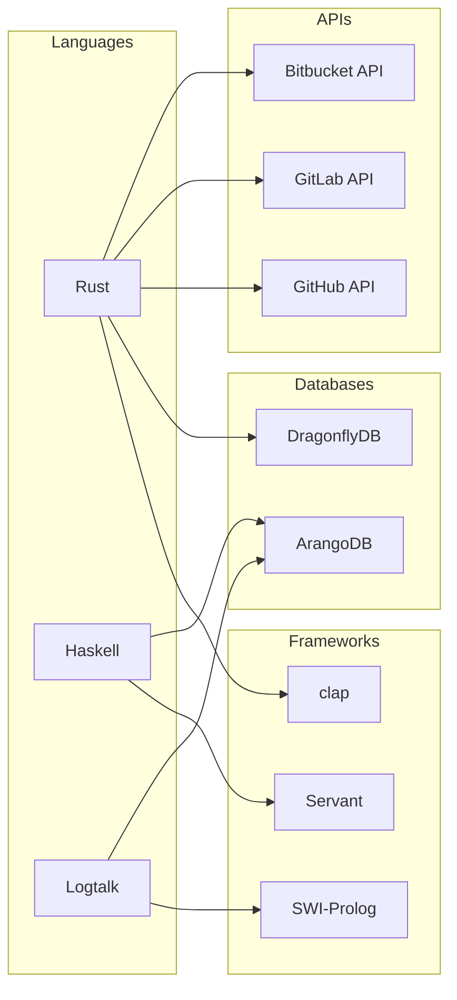
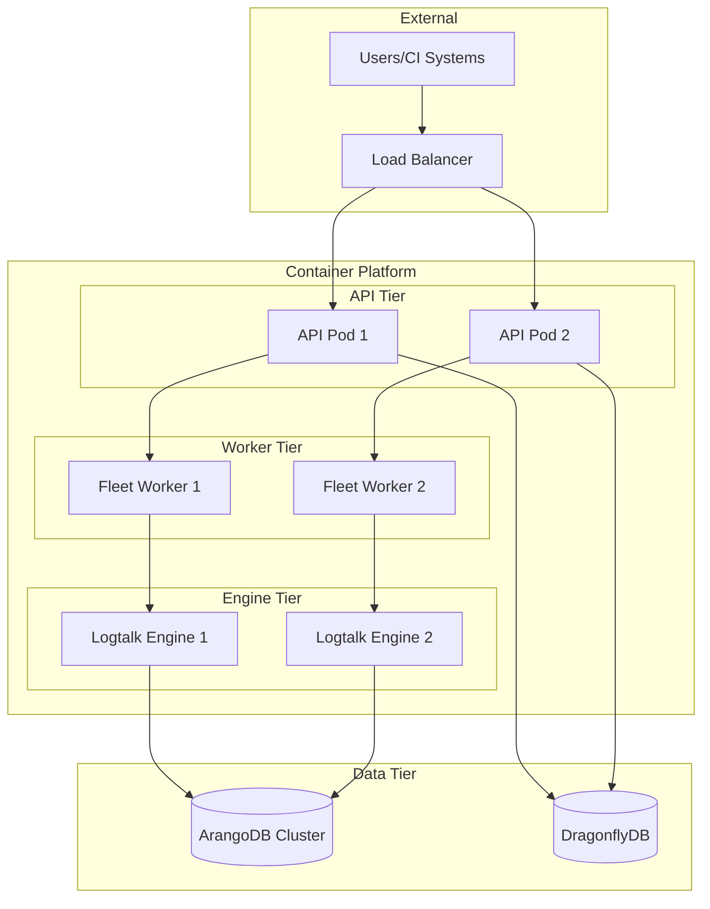

<!-- SPDX-License-Identifier: PMPL-1.0-or-later -->
# cicd-hyper-a System Architecture

## Overview

The cicd-hyper-a platform is a neurosymbolic CI/CD intelligence system that combines neural learning with symbolic reasoning.

## High-Level Architecture

```mermaid
graph TB
    subgraph "User Interface"
        CLI[hyper CLI<br/>Rust]
        API[REST API<br/>Haskell/Servant]
        Hooks[Git Hooks<br/>Shell/Rust]
    end

    subgraph "Core Engine"
        Rules[Rule Engine<br/>Logtalk]
        Learning[Learning Module<br/>Logtalk]
        Distiller[Rule Distiller<br/>Logtalk]
    end

    subgraph "Registry"
        Registry[Ruleset Registry<br/>Haskell]
        Verify[Verification<br/>QuickCheck]
        Storage[(Storage<br/>ArangoDB)]
    end

    subgraph "Bot Fleet"
        Fleet[Fleet Orchestrator<br/>Rust]
        RRA[robot-repo-automaton]
        Glambot[glambot]
        Echidna[echidnabot]
        Seambot[seambot]
        Compliance[compliance-bot]
        Finishing[finishing-bot]
    end

    subgraph "Forge Adapters"
        GitHub[GitHub Adapter]
        GitLab[GitLab Adapter]
        Bitbucket[Bitbucket Adapter]
        Codeberg[Codeberg Adapter]
        SourceHut[SourceHut Adapter]
        Radicle[Radicle Adapter]
    end

    subgraph "Data Layer"
        Cache[(DragonflyDB<br/>Cache)]
        ArangoDB[(ArangoDB<br/>Knowledge Graph)]
    end

    CLI --> Rules
    CLI --> Fleet
    CLI --> Registry
    API --> Registry
    API --> Fleet
    Hooks --> Rules

    Rules --> Learning
    Rules --> Distiller
    Learning --> ArangoDB
    Distiller --> Learning

    Registry --> Verify
    Registry --> Storage

    Fleet --> RRA
    Fleet --> Glambot
    Fleet --> Echidna
    Fleet --> Seambot
    Fleet --> Compliance
    Fleet --> Finishing

    RRA --> GitHub
    RRA --> GitLab
    Glambot --> GitHub
    Echidna --> GitHub

    GitHub --> Cache
    GitLab --> Cache
    Bitbucket --> Cache
    Codeberg --> Cache
    SourceHut --> Cache
    Radicle --> Cache

    Rules --> ArangoDB
```

## Component Details

### User Interface Layer

| Component | Language | Purpose |
|-----------|----------|---------|
| CLI | Rust | Command-line interface for all operations |
| REST API | Haskell | HTTP API for programmatic access |
| Git Hooks | Shell/Rust | Local enforcement at commit/push time |

### Core Engine

| Component | Language | Purpose |
|-----------|----------|---------|
| Rule Engine | Logtalk | Declarative rule evaluation |
| Learning Module | Logtalk | Pattern learning and confidence scoring |
| Rule Distiller | Logtalk | Extract rules from training data |

### Registry

| Component | Language | Purpose |
|-----------|----------|---------|
| Ruleset Registry | Haskell | Store, version, and distribute rulesets |
| Verification | Haskell/QuickCheck | Property-based ruleset validation |

### Bot Fleet

| Bot | Category | Purpose |
|-----|----------|---------|
| robot-repo-automaton | Quality | Repository standards enforcement |
| glambot | Documentation | Documentation generation |
| echidnabot | Security | Secret detection |
| seambot | Quality | Code formatting |
| compliance-bot | Compliance | License/policy compliance |
| finishing-bot | Release | Release preparation |

### Forge Adapters

All adapters implement a common `ForgeAdapter` trait for:
- Repository operations
- Pull request management
- Issue tracking
- Check runs / CI status
- Webhook handling

## Technology Stack



## Deployment Architecture


