<!-- SPDX-License-Identifier: AGPL-3.0-or-later -->
# Bot Fleet Orchestration

## Overview

The cicd-hyper-a bot fleet uses dependency-based topological sorting to execute bots in the correct order.

## Bot Dependency Graph

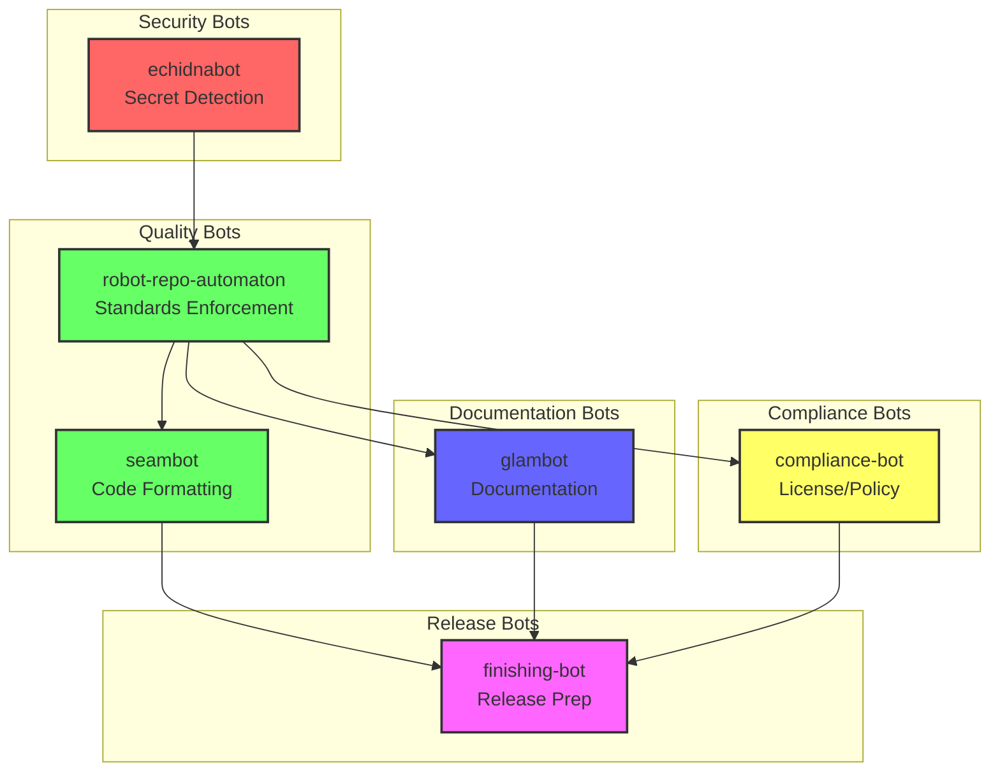

## Execution Order

```mermaid
gantt
    title Bot Execution Timeline (Serial Mode)
    dateFormat X
    axisFormat %s

    section Security
    echidnabot       :0, 30

    section Quality
    robot-repo-automaton :30, 90
    seambot              :90, 120

    section Documentation
    glambot          :90, 130

    section Compliance
    compliance-bot   :90, 140

    section Release
    finishing-bot    :140, 180
```

## Parallel Execution

When `--parallel` is enabled, independent bots run concurrently:

```mermaid
gantt
    title Bot Execution Timeline (Parallel Mode)
    dateFormat X
    axisFormat %s

    section Layer 1
    echidnabot       :0, 30

    section Layer 2
    robot-repo-automaton :30, 90

    section Layer 3 (Parallel)
    seambot              :90, 120
    glambot              :90, 130
    compliance-bot       :90, 140

    section Layer 4
    finishing-bot    :140, 180
```

## Fleet Run State Machine

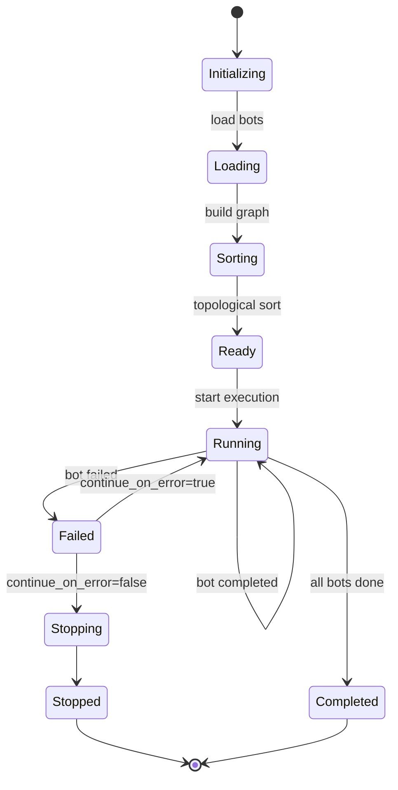

## Bot Execution Flow

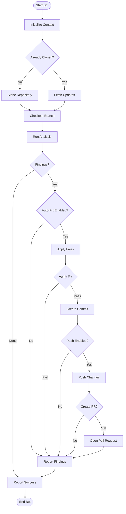

## Category-Based Filtering

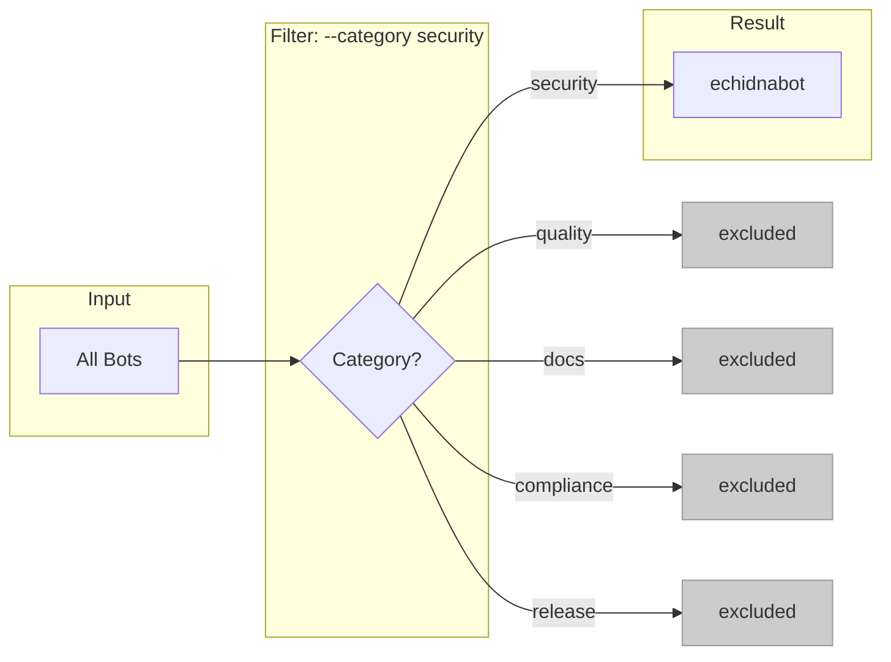

## Bot Selection Logic

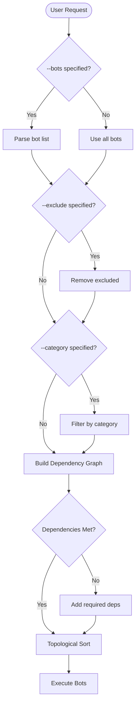

## Error Handling

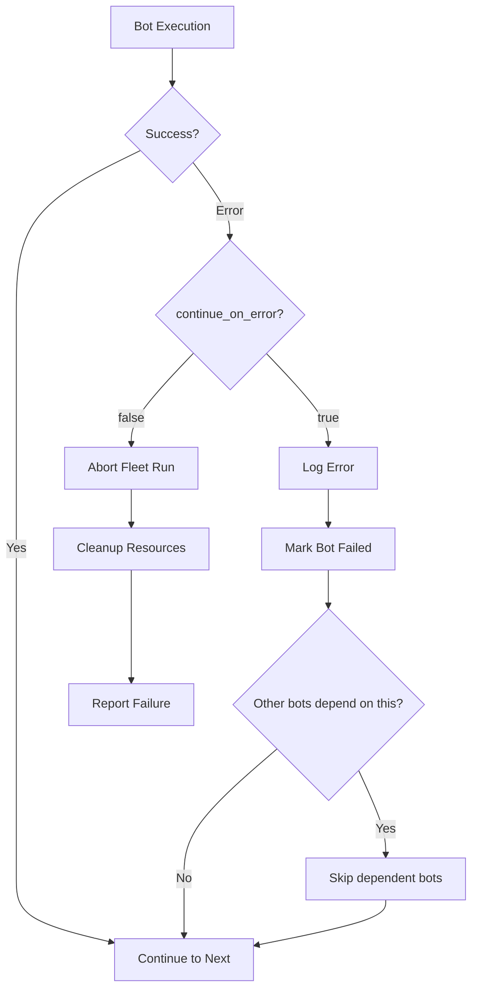

## Resource Management

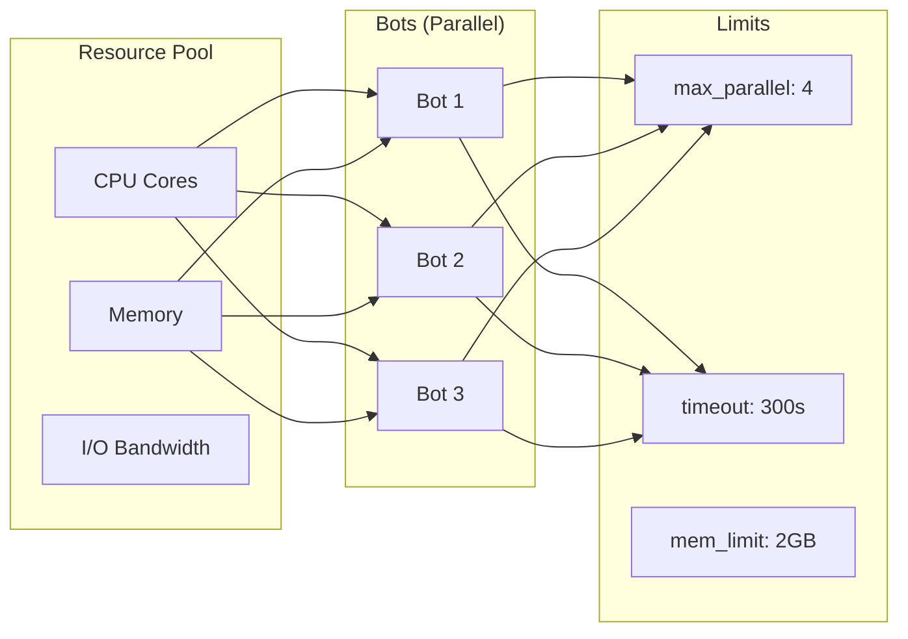

## Bot Configuration Schema

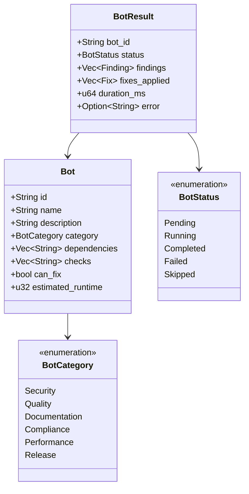

## Fleet Run Summary

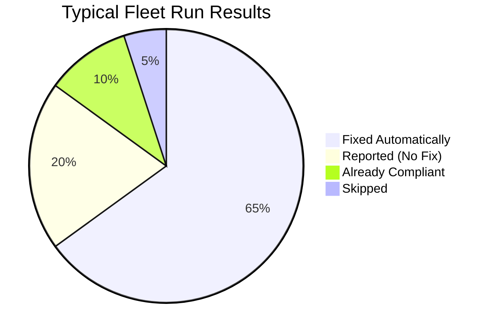
