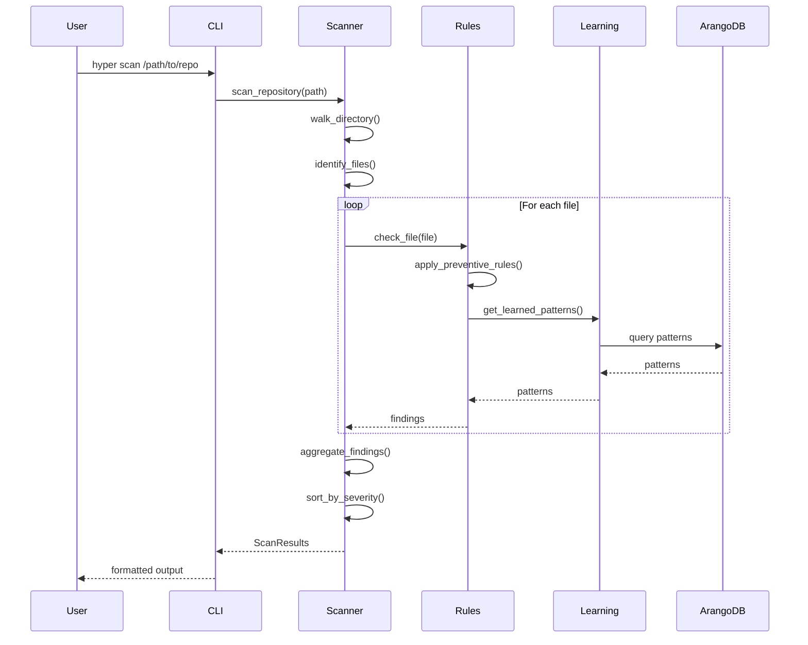
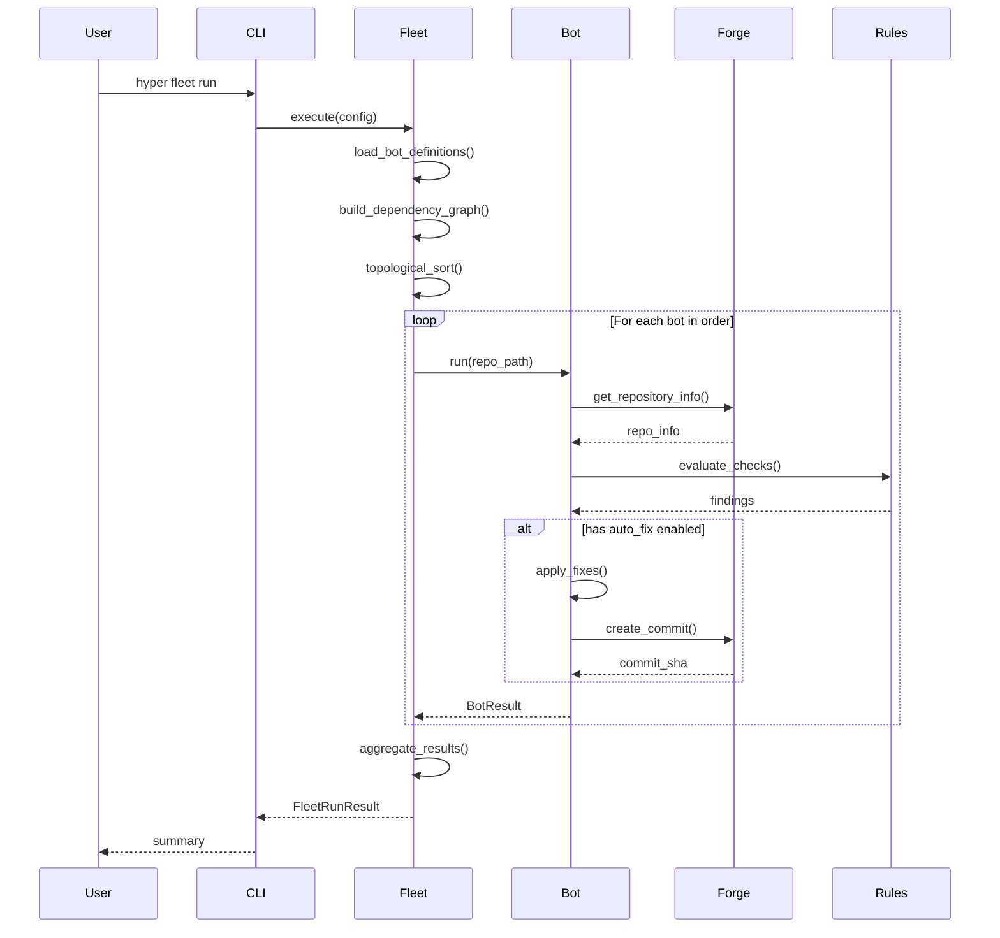
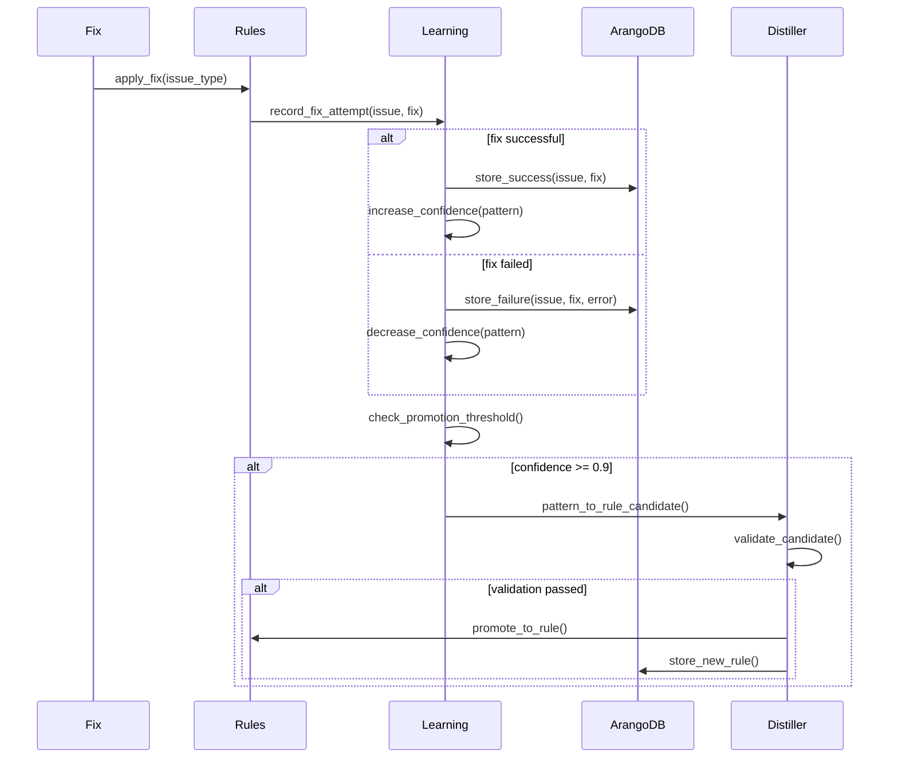
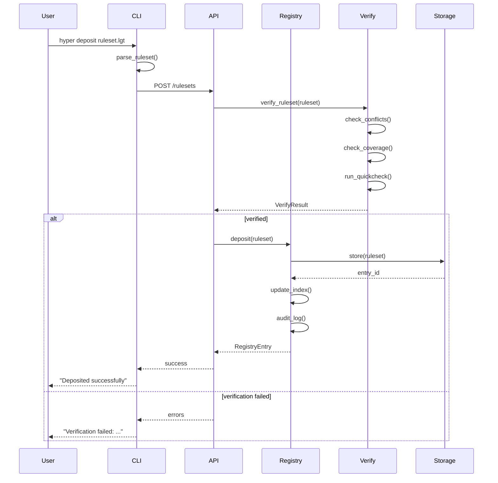
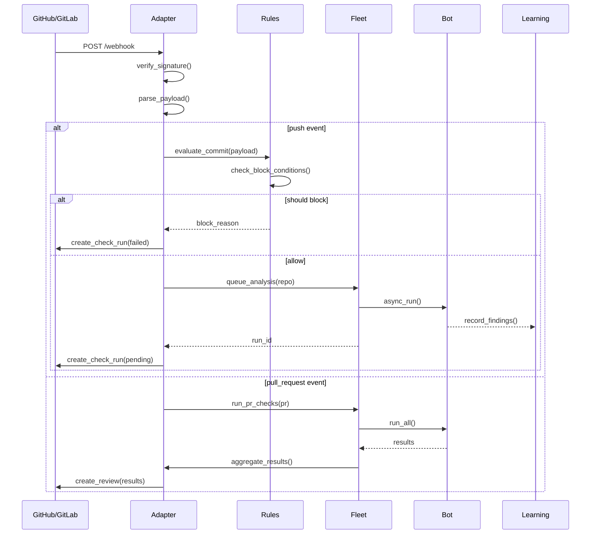
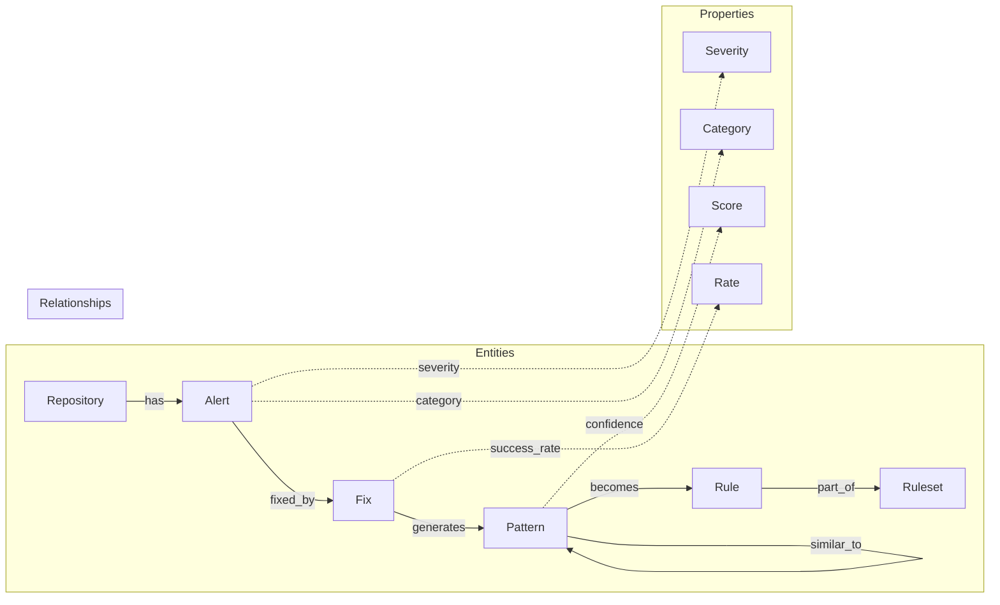
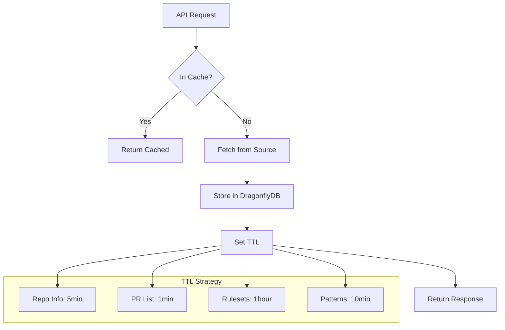
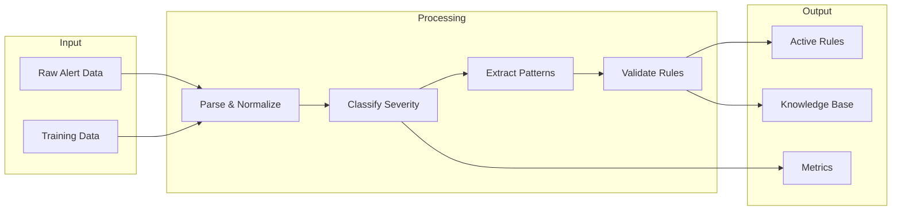

<!-- SPDX-License-Identifier: PMPL-1.0-or-later -->
# cicd-hyper-a Data Flow

## Overview

This document describes the data flow between components in the cicd-hyper-a platform.

## Scan Data Flow

## Fleet Execution Data Flow

## Learning Feedback Loop

## Registry Operations

## Webhook Event Flow

## Knowledge Graph Data Model

## Cache Strategy

## Data Transformation Pipeline

