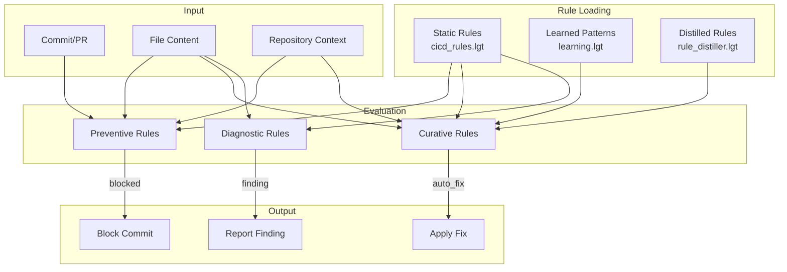
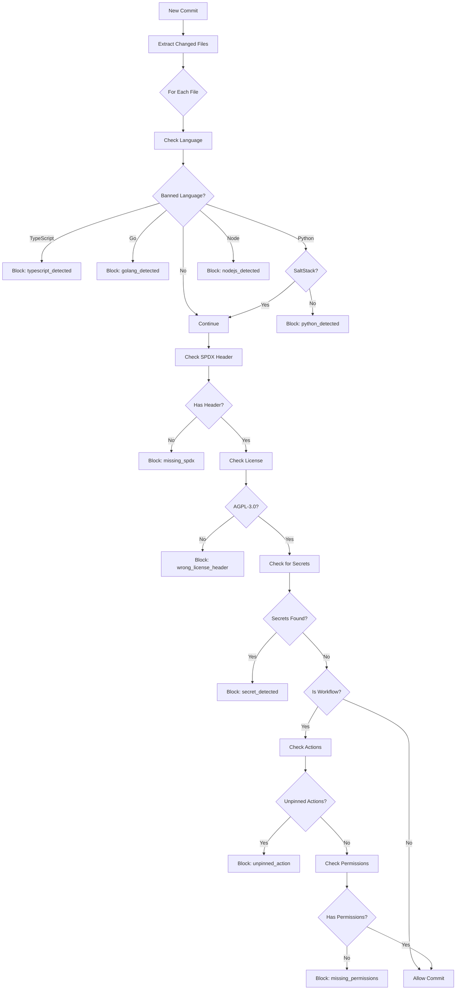
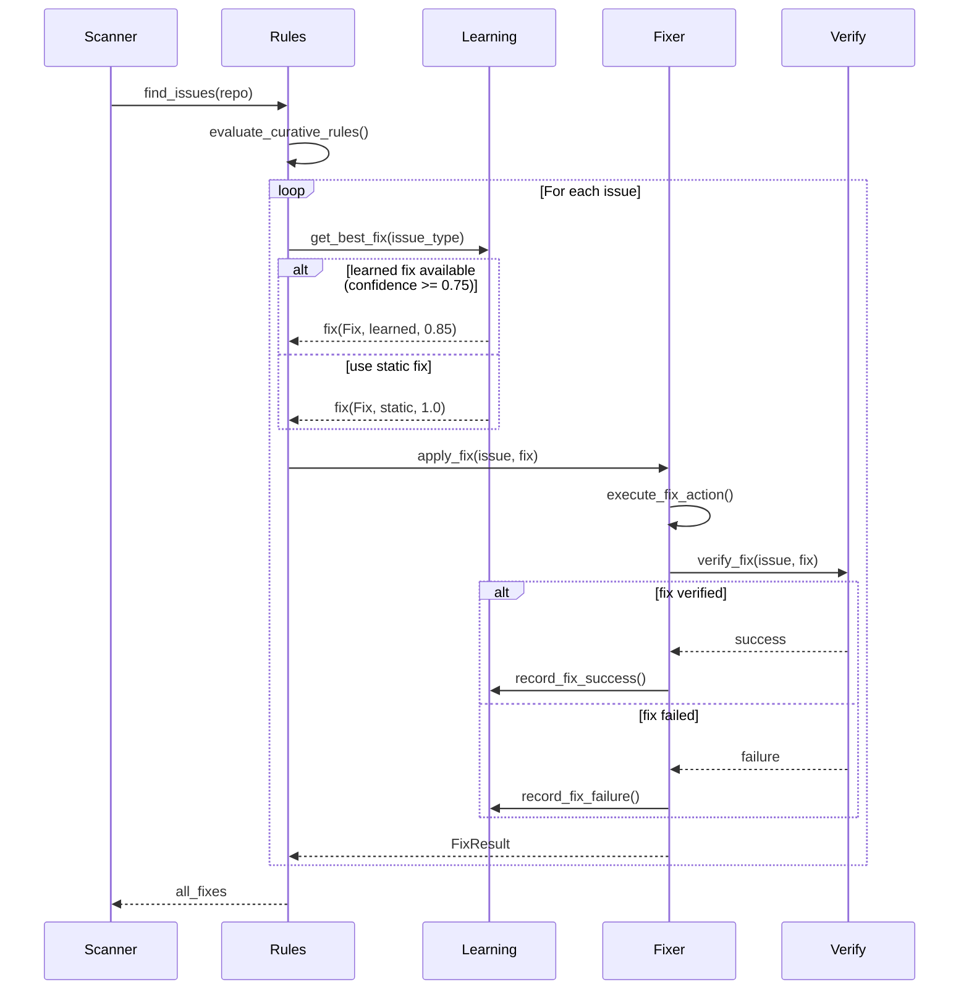
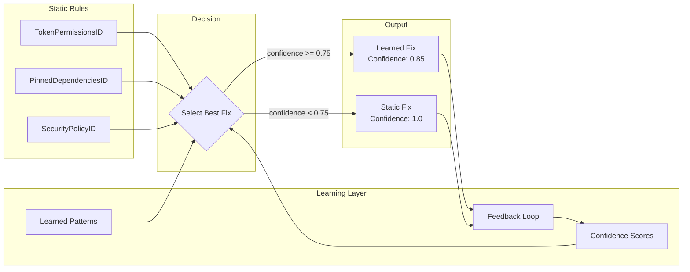
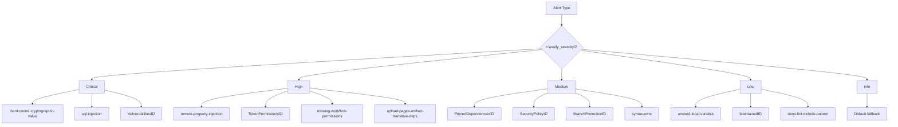
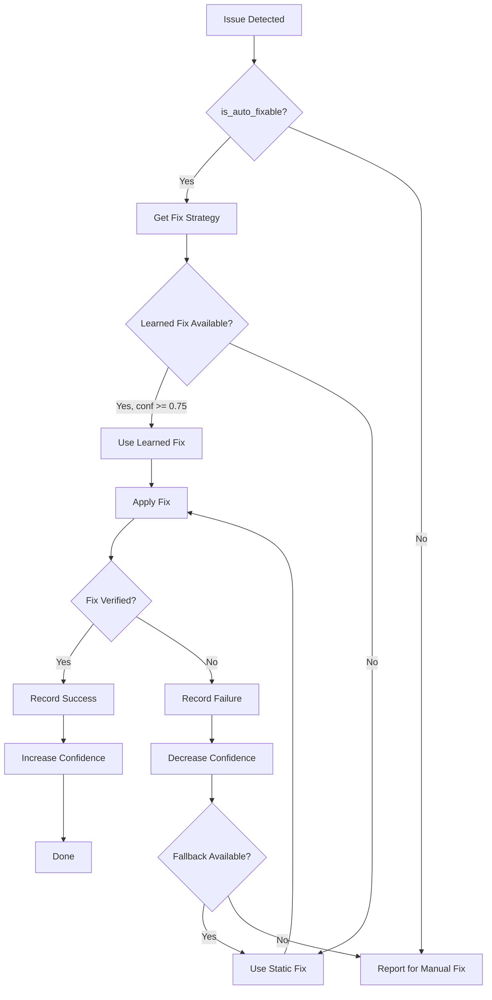
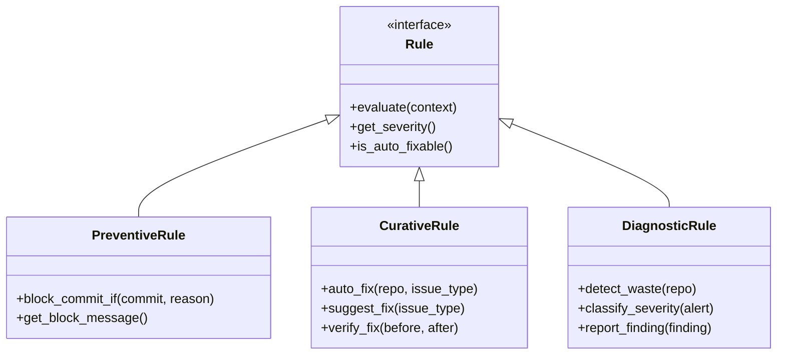
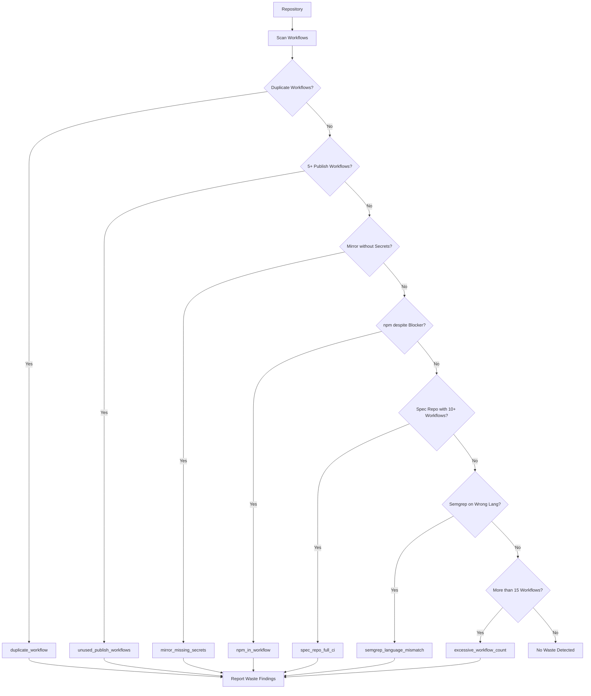
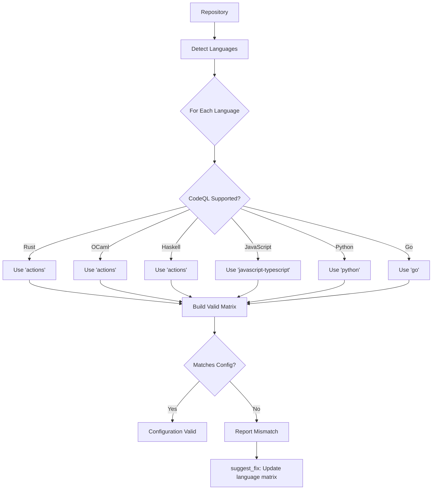
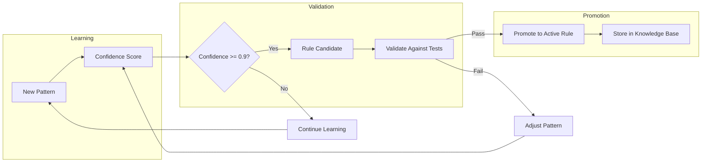

<!-- SPDX-License-Identifier: AGPL-3.0-or-later -->
# Rule Execution Pipeline

## Overview

The cicd-hyper-a rule engine uses a neurosymbolic approach, combining static declarative rules with dynamically learned patterns.

## Rule Evaluation Pipeline

## Preventive Rule Evaluation

## Curative Rule Execution

## Learning Integration

## Severity Classification

## Auto-Fix Decision Tree

## Rule Types

## CI/CD Waste Detection Pipeline

## CodeQL Language Matrix Validation

## Rule Promotion Pipeline

